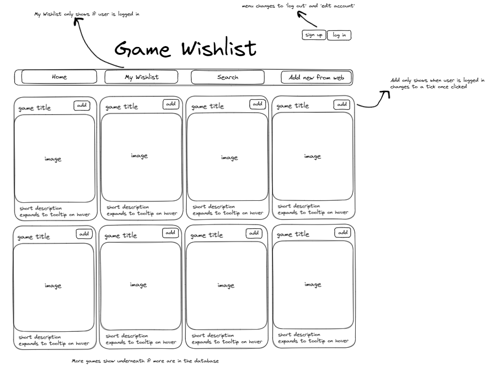
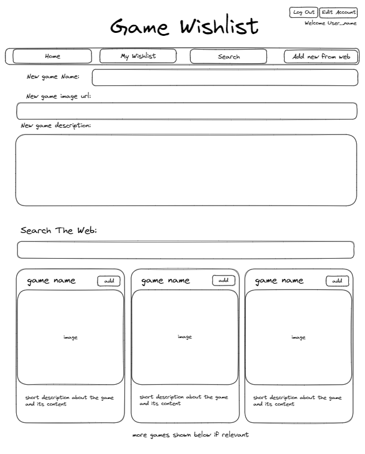

# Video-Game-Wishlist
A wishlist page for users who have signed in to create their own private wishlist of video games. 

## :computer: [Click here](https://video-game-wishlist.onrender.com/) to see my live project!

## :page_facing_up: About
- A web app which allows users who have signed in to add games and mark them as wishlisted, allowing them to keep track of which games they would like to obtain or play in the future. It has multiple pages designed for ease of use, a main page which shows every game, a private wishlist page which is private to each user, a search bar to search for a specific game thats already in the database, and a page for the user to add a new game to the database.

## :pencil2: Planning & Problem Solving
- Created a wireframe to plan the page layout and to assist with planned functionality of certain aspects of the page.

- When planning I created a wireframe as a base template for the home page, then as the task progressed I realized I would need to create further wireframes to help me with my layouts for my new game page.

- Initially when building my project I had a serious issue where on the initial page load it couldn't find the index, I'd checked all my routes and made sure they were loading the correct page but it still couldn't find it, eventually after some investigation I discovered that the initial index page had a prefix applied to it, so it wouldn't load initially as there's no prefix when you first load the page.
- When making my data display on the wishlist page, I had an issue where it would display every game for every users wishlist. After inspecting my method for getting the wishlisted games, I realised I had used the wrong method to access them, and so I had to change the method, instead of getting all games, I made an extra table containing the users id and the games id, this allowed me to link each user with specific games and so on the wishlist page I was able to use that to display only games that the logged in user was linked to via that additional table.
- The remove from wishlist button was not removing any items from the wishlist, through some investigating, I discovered that this was because the id of the game displayed was not the id of the item in the user wishlist database table, this meant that I had to then alter my delete sql to then select the item in the user wishlist, by using 2 parameters instead of just the one id. I did this by passing in the users id as a parameter and the game id as a second parameter, then changed the sql to delete the item from the user wishlist table, where the users id and the games id both matched, so that it would only remove it for that individual user.

## :star2: Potential Improvements.
- Color scheme could be improved to allow for smoother viewing of the page by the user.

## :rocket: Cool tech
- The wishlist page for the site is only viewable by a logged in user, and will only display wishlisted games for that specific user.
- The user is able to edit their account details including their password if they wish.
- Hovering over a games poster image will fade in a description of the game for the user to read.

## :beetle: Bugs to fix
- Currently no known bugs.

## :notebook: Lessons learnt
- When creating the routes for a web app, make sure the index page does not have a url prefix to avoid the page being unable to find it.

## :white_check_mark: Future Features
- On search games page, have ability to search web to add new game to database.